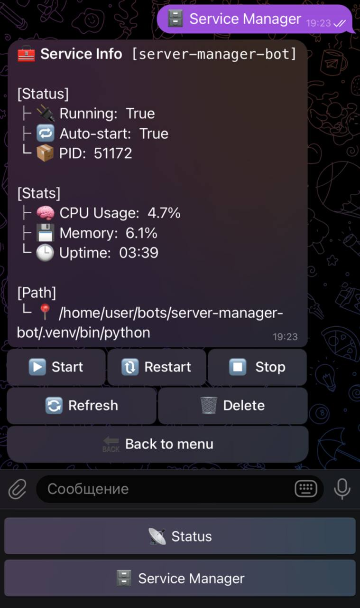

> 🧪 Project is under active development.
> While not production-stable yet, contributions and feedback are highly welcome!

<h1 align="center" id="title">🛡️ Telegram Server Manager Bot</h1>

<p align="center">
  
</p>

<p align="center">
  <a href="https://github.com/df1gg/server-manager-bot/issues?q=is%3Aissue+is%3Aopen+label%3A%22good+first+issue%22">
    
  </a>
  <a href="https://github.com/df1gg/server-manager-bot/issues?q=is%3Aissue+is%3Aopen+label%3A%22help+wanted%22">
    
  </a>
  <a href="https://github.com/df1gg/server-manager-bot/pulls">
    
  </a>
  
  
  
  
  
</p>

<p align="center">
  <b>Minimal, secure and extensible Telegram bot to monitor and control your Linux server — from anywhere.</b>
</p>

---

## 🧾 Description

**Telegram Server Manager Bot** is a lightweight self-hosted bot that lets you:

- Monitor server metrics (uptime, CPU, RAM, disk, swap, temperature, and more)
- Manage systemd services (start/stop/restart)
- View and tail logs from services or files
- Upload/download files directly through Telegram
- Inspect network: local/public IP, bandwidth usage, listening ports
- Identify top processes by CPU/RAM
- Whitelisted admin-only access

Ideal for hobbyists, sysadmins, and minimal Linux lovers who don’t want to deal with full dashboards like Cockpit or Netdata.

---

## 📸 Screenshots

<p align="center">
  
  
  
</p>

---

## 🧐 Features

- **System Metrics**: uptime, CPU, RAM, disk, swap, CPU temperature, load average
- **Network Info**: local/public IP, downloaded/uploaded bytes (human-readable), packet counts
- **Processes**: top CPU and RAM consumers
- **Hostname**: server identifier in status header
- **Security**: access limited by Telegram ID(s) & access logs
- **Extensible**: modular utilities, middleware, and decorators for easy expansion
- **Systemd service manager**: allows you to view and manage detailed information about the service
- **Service Down Alerts**: notifies you via Telegram if any monitored systemd service goes offline

---

## 🛠️ Installation

1. **Clone the repo**

```bash
git clone https://github.com/df1gg/server-manager-bot.git && cd server-manager-bot
```

2. **Create and activate virtualenv**

```bash
python3 -m venv .venv
source .venv/bin/activate
```

3. **Install dependencies**

```bash
pip install -r requirements.txt
```

4. **Create `.env` file**

```env
BOT_TOKEN=your_telegram_bot_token
OWNER_IDS=123456789,987654321   # comma-separated list of admin IDs or one ID
```

5. **(Recommend) Allow the bot to use systemctl without sudo password**

If you want the bot to manage system services (start, stop, restart) via `systemctl`, your user must be allowed to use it without entering a password.

- First, find the full path to systemctl:

```bash
which systemctl
```

(Usually it's `/bin/systemctl`)

- Then open sudoers file:

```bash
# Option 1 — nano (easy for beginners)
sudo EDITOR=nano visudo

# Option 2 — vim
sudo EDITOR=vim visudo
```

- Add this line at the bottom, replacing `yourusername` with your actual username:

```bash
yourusername ALL=(ALL) NOPASSWD: /bin/systemctl
```

(Replace `/bin/systemctl` with actual path if different)

⚠️ Be careful: always use `visudo` to avoid syntax errors!

6. **Run the bot as a systemd service**

This allows the bot to start automatically with your system and run in the background.

- Create a systemd service file:

```bash
# Replace "yourusername" with your actual Linux username
sudo nano /etc/systemd/system/server-manager-bot.service
# Or use vim: sudo nano /etc/systemd/system/server-manager-bot.service
```

Paste this content into the file:

```sh
[Unit]
Description=Server Manager Bot
After=network.target

[Service]
User=yourusername
WorkingDirectory=/home/yourusername/server-manager-bot
ExecStart=/home/yourusername/server-manager-bot/.venv/bin/python main.py
Restart=on-failure
RestartSec=10

[Install]
WantedBy=multi-user.target
```

❗ **IMPORTANT:**
Make sure to replace `yourusername` and the paths (`WorkingDirectory`, `ExecStart`)
with the correct ones for your system. Use `pwd` to check the full path to your project.
Also make sure `.venv/bin/python` exists — or adjust to the correct Python path.

- Reload systemd and enable the service:

```bash
sudo systemctl daemon-reexec
sudo systemctl daemon-reload
sudo systemctl enable server-manager-bot
sudo systemctl start server-manager-bot
```

- Check logs (optional):

```bash
journalctl -u server-manager-bot -f
```

- If you ever want to stop the bot:

```bash
sudo systemctl stop server-manager-bot
```

🎉 **Congratulations!**
Your Server Manager Bot is now running as a background service and will automatically start on boot.

---

## 🍰 Contribution

Contributions are welcome! To contribute:

1. Fork the repository
2. Create a feature branch (`git checkout -b feature/your-feature`)
3. Commit your changes (`git commit -m "feat: your feature description"`)
4. Push and open a Pull Request against `dev`

Please keep the code clean and follow the project style.

---

## 💻 Built with

- **Python 3.11+**
- [Aiogram 3.x](https://github.com/aiogram/aiogram) — Telegram Bot Framework (async)
- `asyncio`, `socket`, `os`, `psutil`, `subprocess` — core system tools
- `SQLAlchemy`, `aiosqlite` — database for save options
- `loguru` — structured and colorized logging
- `systemd` — Background service handling
- `dotenv` — Secure environment-based config

---

## 🔐 Security & Access Control

- Only IDs in `OWNER_IDS` can interact with the bot
- Unauthorized users receive a `⛔ Access denied` message and no handlers run
- Flexible middleware and decorator support for further restrictions or authentication

---

## 📌 TODO

### 🟢 MVP / Must-have

- [x] Display server status info with inline refresh button
- [x] Admin-only access control by Telegram ID(s)
- [x] Service management
  - Automatic discovery of available systemd services
  - Add/remove services from management list
- [x] OS version display (distribution and kernel)
- [ ] Auto-refresh status periodically
- [ ] Reboot & Poweroff functionality

### 🔵 Nice-to-have (v1)

- [ ] Docker integration: list containers, start/stop/restart via buttons
- [ ] Graphs: CPU/RAM/Disk/Swap usage over the last hours
- [ ] Alerts & Notifications: send Telegram alerts on high load or service failure
- [ ] Port scanner: list listening TCP ports with process names
- [ ] Cron-manager: add/remove cron jobs via bot commands
- [ ] Log search: grep-like filtering of logs

### ⚫️ Future / Extras

- [ ] Internationalization (i18n) — multi-language support
- [ ] CI/CD trigger — deploy or tests via bot
- [ ] Batch commands execution — run multiple commands in sequence

---

## 🛡️ License

This project is licensed under the **MIT License**.  
Feel free to use, modify, and share.

---

## 👤 Author

Made by [df1gg](https://github.com/df1gg) with ❤️
